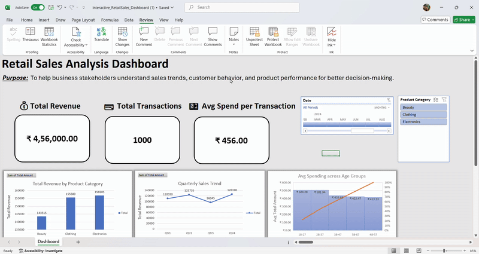

# 🛍️ Retail Sales Data Analysis Dashboard

This repository contains an interactive dashboard built using Microsoft Excel to analyze retail sales data for the year 2023. The project is designed to showcase data-driven insights, patterns, and trends that can help businesses make informed decisions.

## 📌 Project Highlights

- 📆 Sales performance tracked monthly and quarterly
- 🛒 Category-wise breakdown   
- 🎯 Interactive dashboard using slicers and dynamic KPIs

## 💻 Tools & Techniques Used

- Microsoft Excel  
  - PivotTables  
  - Charts & Graphs  
  - Conditional Formatting  
  - Slicers & Filters  
  - GETPIVOTDATA for dynamic KPI cards

## 📁 Files Included

- `Retail_Sales_Analysis_Dashboard.xlsx` – Fully interactive Excel dashboard  
- `Retail_Sales_Analysis_Dashboard.pdf` – Static view for quick access

## 🔍 Key Insights

- 🟢 Sales peaked in specific quarters indicating seasonal trends  
- 🟡 Certain product categories consistently outperformed others   
- 📊 Enabled business users to filter data on-the-fly for custom analysis

## 🚀 Getting Started

1. Download or clone the repository.
2. Open `Retail_Sales_Analysis_Dashboard.xlsx` in Microsoft Excel.
3. Use slicers to explore data across different dimensions.
4. View the `PDF` version for a non-interactive overview.

## Vaishnavi Sinha
[LinkedIn](https://www.linkedin.com/in/vaishnavi-sinha-v2005/)
